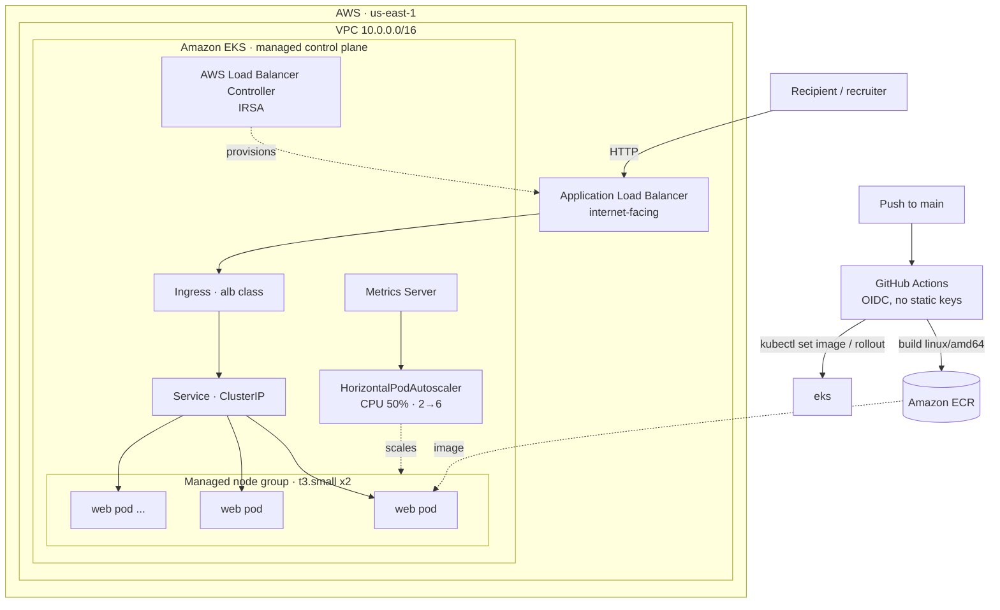

# Architecture

## Components

- **Amazon EKS (managed control plane)** — Kubernetes API/etcd run by AWS;
  Terraform provisions the cluster, addons (CoreDNS, kube-proxy, VPC CNI), and a
  managed EC2 node group.
- **VPC** — two AZs, public + private subnets; nodes run in private subnets with
  a single NAT gateway for egress. Subnets are tagged for ALB auto-discovery.
- **AWS Load Balancer Controller** — watches `Ingress` objects and provisions a
  real ALB with pod-IP target groups. Runs with **IRSA** (scoped IAM via its
  service account), not node-wide credentials.
- **Ingress → Service → Pods** — the ALB routes to a ClusterIP Service, which
  load-balances across the `web` Deployment's pods.
- **Metrics Server + HPA** — CPU metrics feed the HorizontalPodAutoscaler, which
  scales the Deployment 2→6 under load.
- **GitHub Actions (OIDC)** — builds the amd64 image, pushes to ECR, and rolls it
  out to the cluster with no static AWS keys. Cluster access is granted to the
  CI role through a modern **EKS access entry**.

## Security posture

- Keyless CI (OIDC), IRSA for in-cluster AWS access, least-privilege node role.
- Non-root container, read-only root filesystem, dropped Linux capabilities,
  `RuntimeDefault` seccomp, resource requests/limits.
- Private node subnets; the API server is public-endpoint but RBAC-gated via
  access entries.
